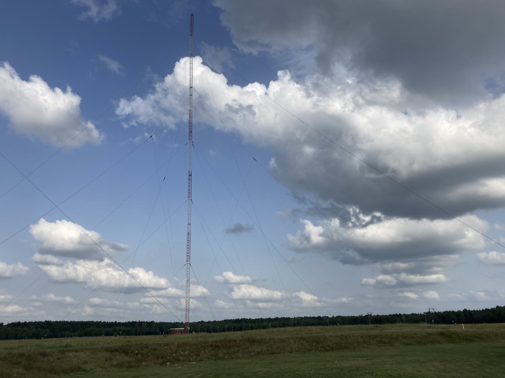
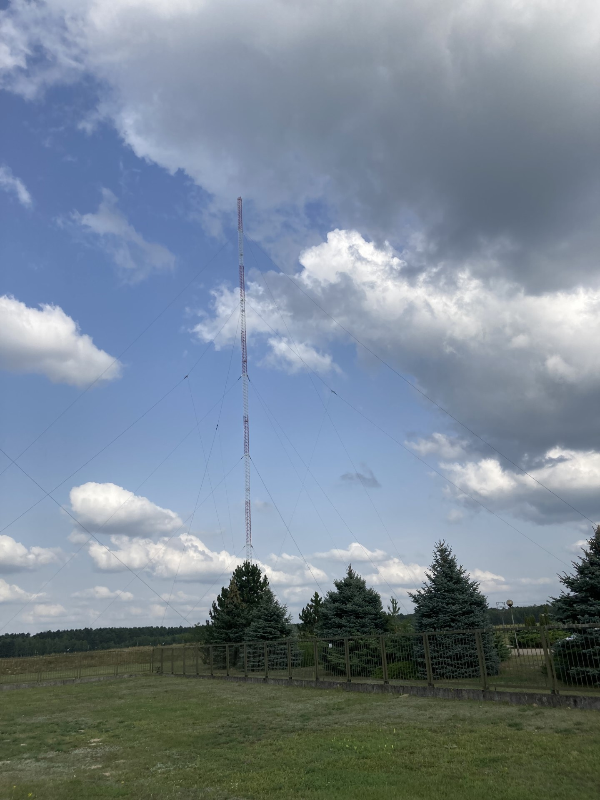

## Na podstawie informacji umieszczonej przed budynkiem 
## Radiowego Centrum Nadawczego (RCN) w Solcu Kujawskim

Polskie Radio
Radiowe Centrum Nadawcze w Solcu Kujawskim

To jedna z najnowocześniejszych w Europie centralna stacja nadawcza o mocy 1000kW, 
emitująca od 4 września 1999 r., na falach długich sygnał o częstotliwości 225kHz, 
Program Pierwszy Polskiego Radia. Swym zasięgiem obejmująca całą Polskę i częściowo
kraje sąsiadujące, a przy sprzyjających warunkach dalcze kraje europejskie.

Kompleksowym dostawcą aparatury nadawczej najnowszej generacji i systemu antenowego
jest francuska firma THOMCAST.

Półprzewodnikowy nadajnik o gwarantowanej sprawności energetycznej 88%, składa się z 
trzech bloków i sumatora, dzięki czemu możliwa jest również praca na dwóch blokach
przy trzecim znajdującym się w konserwacji, co wznacznym stopniu zwiększa niezawodność 
emisji. 

Dla poprawy efektywności pracy nadajnika, zastosowany został system dynamicznej 
regulacji poziomu fali nośnej DCC.

System antenowy, o maksymalnym promieniowaniu w kierunku południowo-wschodnim,
tworzą dwa ćwierćfalowe maszty o wysokości 230 i 289 metrów oraz uziemnienie, będące
przeciwagą elektromagnetyczną. Maszty utrzymywane są w pionie przez pięć poziomów 
odciągów, wykonanych z lin stalowych o średnicy 40mm.

Energia wysokiej częstotliwości z nadajnika przekazywana jest drutową linią współosiową 
(fiderem), a następnie za pośrednictwem przedostatniego poziomu odciągów do masztów.
Najwyższy nieizolowany poziom odciągów, galwanicznie połączony z ziemią, stanowi 
skuteczną ochronę przed wyładowaniami atmosferycznymi.
Od 2015 roku rozpoczniemy cyfrową emisję programów Polskiego Radia w standardzie DAB+
na obszar województwa kujawsko-pomorskiego.

Teren RCN o powierzchni 75ha, ogrodzono płotem o długości 4.5km, stanowiącym granicę
strefy pośredniej promieniowania elektromagnetycznego.

Maksymalne odchylenie szczytu masztu przy silnym wietrze wynosi 1.5m.
Waga masztów: 304 tony.

Czas wejścia na szczyt masztu wysportowanego człowieka: 1 godzina

Mapa zasięgu oraz poziom sygnału zarejestrowany w Otwocku pod Warszawą:

