# Crystal Radio Receiver

## Design Overview

Implementation of crystal radio in its simplest form does not include active amplifier and that is why can function without external power supply. 

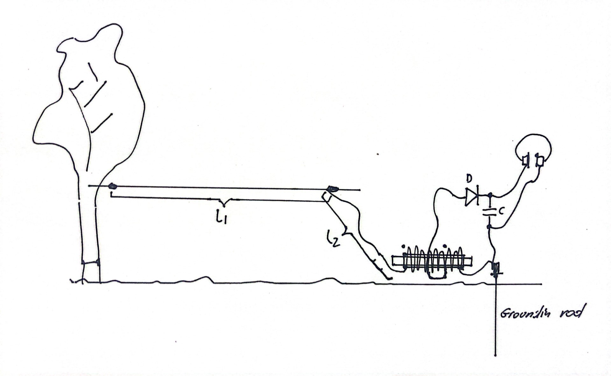

There are three building blocks of such radio: bandpass filter based on RLC circuit, detector/demodulator stage and high impedance headphones (common today 32ohm headphones can be used as well, but would require amplification stage).

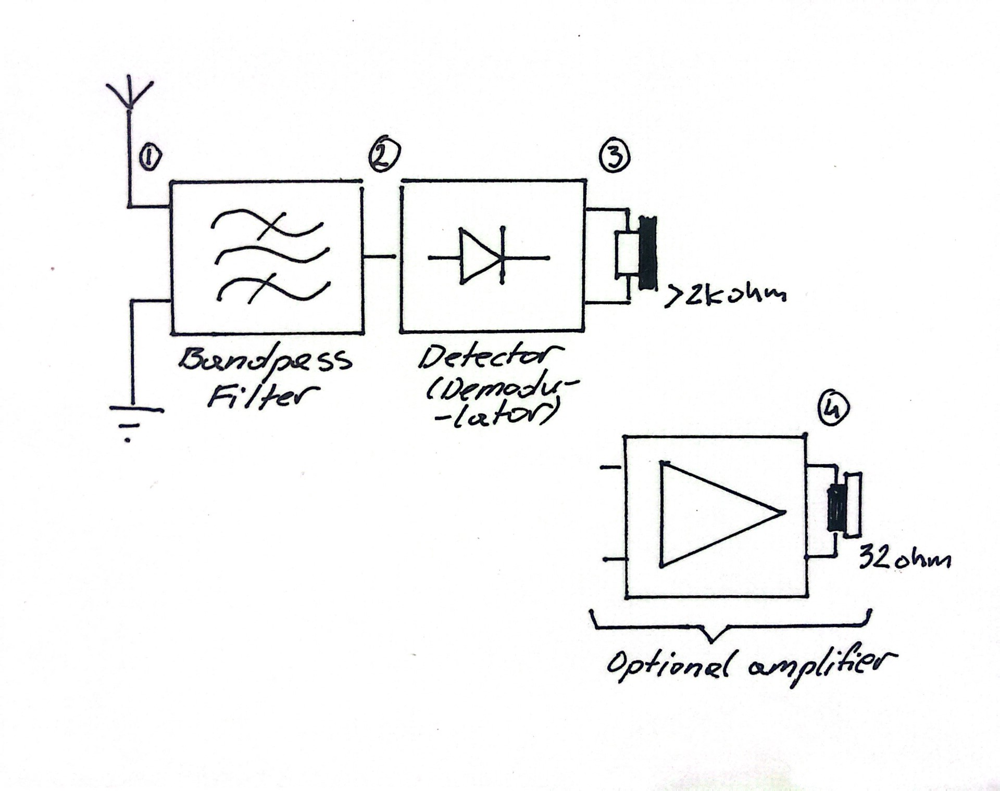

Contrary to common believe that crystal radio unit always include RLC parallel resonant circuit, design described here is based on serial resonant RLC circuit consisting of random wire antenna and the coil. Random wire antenna provides capacitance required to form together with the coil serial LC resonant circuit. 

To decrease impact of relatively low detector stage impedance on quality Q of LC circuit, tapped coil is used (autotransformer configuration). 
In ealry designs both tap and also coil itself was often skipped. In such implementation signal level reaching detector stage would be higher (assuming detector input impedance will be higher then the one of coil), but there will be very poor or no selectivity. 

Compromise between output signal strenth and selectivity is a main challange of crystal radio design. 

In discussed circuit, crystal has been replaced with germanium diode. Half-wave rectifier has been also replaced with full rectifier configuration in actual implementation. This however did not lead to any improvments in signal quality or strength since benefit of increased output voltage has been ofsetted by incresed load (x2) put by this type of rectifier on the coil compared to its half wave variant. This is the reason for leaving half wave recifier on all drawings mentioned in this section.

Experiments were made with use of more common Shotkeys diodes, but were not successful (not possible to detect any signals).

Due to relatively high detector output impedance, the use of high impedance headphones or high input impedance amplifier stage is a must.

Capacitor C, which filters out carrier frequency from baseband signal has been left in the design, but its presence did not make any impact on output signal quality.

This type of crystal radio design requires unbalanced antenna i.e. grounding must be of high quality (resistance of 10-100ohm) in order for radio to operate.

Electronic circuit has been inspired by design described by Andrzej Dabrowski OE1KDA in Swiat Radio [1] / Issue 54 of Library of Polish HAM [2] and 
more recent work of Bob Culter N7FKI in ARRL QST magazine [9].

Theory of operation has been predicted during Spice simulations. Details of technical design are based on great work of Berthold Bosch, DK6YY  Crystal Set Analysis [5],  Kenneth A. Kuhn, Crystal Radio Engineering [7] and Johen Bauer, Receiving Antennas for the AM Bands = Loop vs. Vertical Wire [8].

## Design Details

### Bandpass filter stage

As mentioned earlier in this particular implementation of crystal radio, antenna and the coil form the resonant serial RLC ciruit, which can be modelled as depicted on the drawing below:

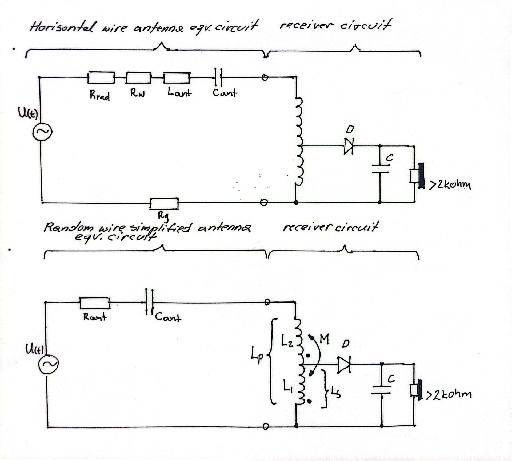

where [7],[8]:
* 	**U(t)** - ideal voltage source - antenna voltage pickup
* 	**Cant** - antenna's serial capacitance - dominating part of antenna's 	reactance if the antenna is shorter than one-quarter wavelength
* 	**Lant** - antenna's serial inductance -  dominating part of antenna's reactance if antenna is  between one-quarter and one-half wavelength at      which capacitive reactance dominates. (at one quarter wavelength antenna is resistive) next quarter wavelength
* 	**Rrad** - The effective radiation resistance associated with the total antenna length. For electrically short antennas this may only be a few ohms but can rise to several tens of ohms as the antenna length approaches one quarter wavelength.
* 	**Rw**   - electrical resistance that is mainly due to the skin effect of the conductor (antenna wire) since the frequency is high
* 	**Rg**   - ground resistance

In case of random wire antenna for long wave reception, antenna's electrical length is typically much smaller then lambda/4 coresponding to received frequency.

In our case the target frequency is f = 225kHz (Polish Radio Warszawa I Broadcast) and coresponding wave length:

$lambda = vf* (c/f)$ 

where:
* **c**  - speed of light in free space: 299 792 458 m/s
* **vf** - velocity factor for cooper wire: 0.95 (radio wave travels in the wire 5% slower then in free space)
* **f**  - broadcast frequency

hence:

* lambda (free space) = 1332,4m (lambda/4=333,1)
* lambda (cooper wire) = 0.95 * 1332,4 = 1265,8m (lambda/4 = 316.5m)

So the total length of our antenna cable (including wire leading to the radio) is 23m, which is shorter then lambda/4 for both free space and cooper wire.

Above means that antenna's reactance is purly capacitive  and **Lant** can be omited from the simplified model of used antenna design.

Due to the short length of antenna cable, wire resistance **Rw** can also be skipped.

Radiation resistance **Rrad** for electrically short antennas is typically equal to a few ohms (**Rrad** can rise to several tens of ohms as the antenna length approaches one quarter wavelength).

Ground Resistance **Rg** is dominant in the model and can be less then 10 ohms in case of excellent grounding and up to 100ohms and more when grounding is poor.

Based on above analisys and actual measurements summarized in table below it is apparent that random wire antenna's equivalent circuit can be simplified to include only capacitance **Cant** and **Rant** equal to Rg + Rrad. 

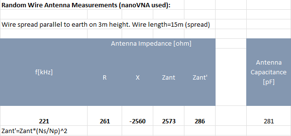

The frequency of serial resonance for such circuit can be calculated as:

$fr=\frac{1}{2*\pi*\sqrt{Lp*Cant}}$

where **Lp** is the inductance of the coil expressed as:

$Lp=L1+L2+2M$

**Lp**, **L1** and **L2** can be directly measured with NanoVNA or another inductance meter while M can be calculated as:

$M=(Lp-L1-L2)/2$

For simulation purpuses it is useful to also calculate coupling coefficient **k** as:

$k=M/\sqrt{L1*L2}$

Actual measurements were summarized below:

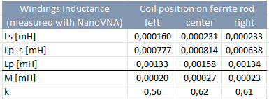

For the coil centrally positioned on the ferrite rod resonance frequency is:

$fr=\frac{1}{6.28*\sqrt{1.58*10^-3*281*10^-12}}=239kHz$

It was not possible to increase coil's inductance Lp by repositioning it on the rod. That is why 47pF additional capacitor was added in parallel to Lp to bring resonance frequency fr to desired 225KHz. See Spice simulation below:

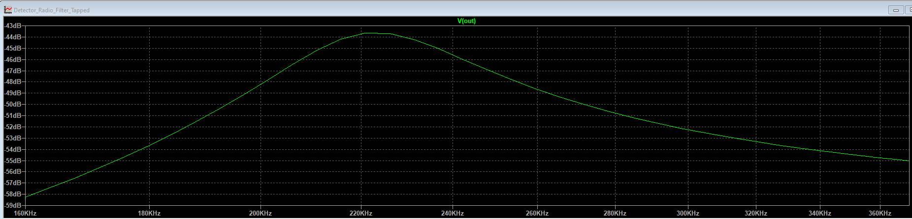

Design of the coil is critical for entire circuit to work. This element has been made using 0.35mm emalia coated wire. Windings were made on paper tube put on ferrite rod from old radio receiver. Position of the coil can be adjusted by sliding to both sides of the rod allowing for limited resonance frequency adjustment. Tuning is made by the ear for strongest acusting signal. Coild winding configuration: 50 windings - 5cm long tap - 100 windings. All windings are made in the same direction. Parasitic capacitance of the coil allowed to put LC tank into resonance closed to target 225kHz frequency without connecting any capacitor. To bring resonance frequency closer to 225kHz, the 47pF ceramic capacitor was put parallel to the coil. Decreasing this capacitor to smaller value did not increase signal level at detector output, capacitor increase led to decrease in volume, which suggest that selected capacitance value is optimal for this particular design.

Mechanical mounting of the coil can be difficult. The most elegant would be to 3D print required moutning brackets. In this case simpler wooden mounts were used purely due to lack 3D printer access. See pictures below for details of coil mounting method:

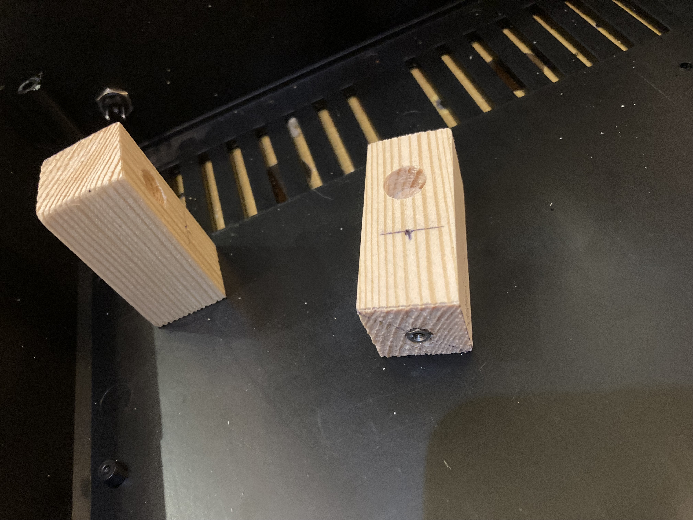

Value of LC tank elements can be calculated from the following formula:

$fr = 1/[2*PI*SQRT(L*(Cparacetic+C))]$

where fr = 225kHz
      L = (measured between ends of two sections - see picture below)
      C = 47pF (chosed by experimentation as described above)

Solving for Cparacitic gives us:

                                                            $fr*2*PI*SQRT(L*(Cparacetic+C))=1$
                                                              $L*(Cparacetic+C)=1/(fr*2*PI)^2$
                                                            $Cparacitic = 1/[L*(fr*2*PI)^2] - C$

Cparacitic (value of paracitic capacitance introduced in the coil) equals to ... pF.

Simulated characteristic of LC tank can be seen below:

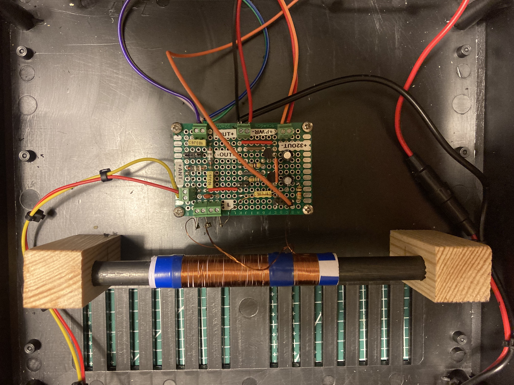
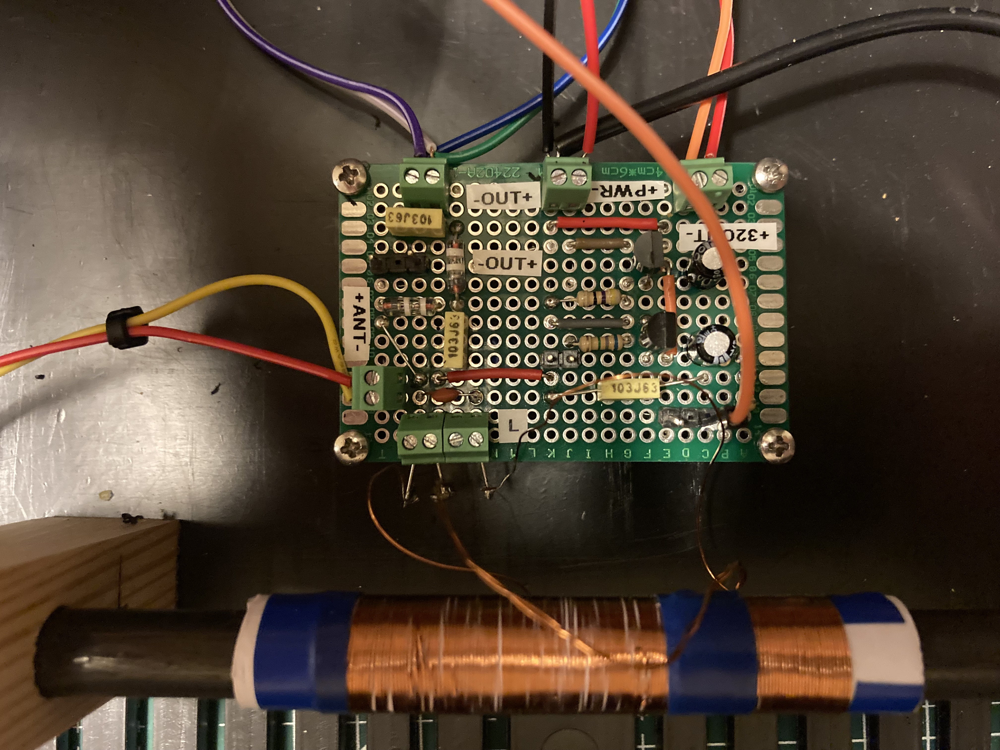

Tap on the coil does not impact resonance frequency, however level of magnetic coupling shall be taken into account when calculating inductance value of the coil i.e. total inductance is higher then the sum of inductances of each section of the coil measured separately.

It shall be noted that in case of my design parasitic capacitance of the coil was very high and cannot be neglected in overall calculation of capacitor value (space existing between windings introduce unwanted capacitance).

Special thanks  to SP5... for great explanation of theory behind LC design [3] and time taken to anwser my emails.

Impedance value of LC tank at and around resonance frequency is very high (hundrats of kiloohms). This works well with random wire antennas since their impedance is in the range of 3kohm and above. It is not possible however to directly stimulate such LC circuit with NanoVNA or other test equipment with low output impedance (typically 50ohm) and expect to see circuit impedance peak at fr=225kHz... 

Impedance of detector stage is affected by the type of airphones used. In this simple design use of modern 32ohm headphones is not possible (detector stage would have too small impedance attenduating LC circuit). Instead high impedance earphone must be used (4kohm impedance).

Quality of earthing strongly impacts detector signal output level that is why good connection to earth is mandatory to receive acceptable volume heart in airphone.

To increase signal output and allow for use of 32ohm modern headphones simple 2 transistor amplifier has been added. Voltage amplification of this stage is in the range of 60 (see simulation result below):

>TRAN SIMULATION PICTURES<

Acustic signal at the output of the detector stage is biased towards higher frequencies. To correct for it low-pass filter is introduced together with volume control. Filtering introduces attenuation and it shall not be used in configuration with high impedance earphones.

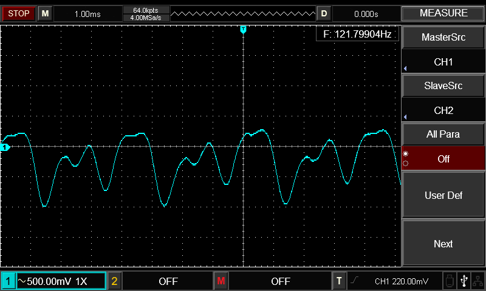
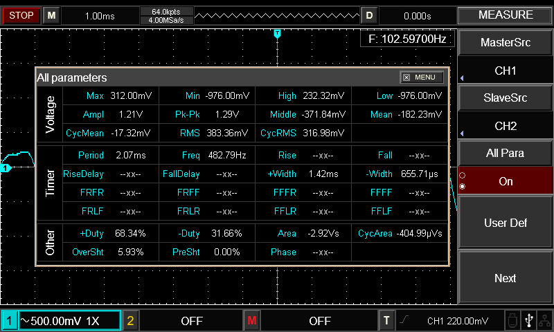

To further increase amplification LM386 based power amp can be used.

## Resources

[1] Swiat Radio 4/2014, Building Simplest Radio, http://www.swiatradio.com.pl/virtual/
[2] Library of Polish Radio Amateur, Issue 54: Simple Amateur Receivers, Part I, https://bpk.pzk.org.pl/
[3] Parallel Tuning Circuit by Marcin Swietlinski SP5NJW, https://sem.pl/sp5jnw/technika/technika.html
[4] LTspice tutorial - Modeling transformers, https://youtu.be/muUwe8X51oY?si=RbQENTwcjtkwcD5b
[5] Crystal Set Analysis,Berthold Bosch, DK6YY, https://www.pe2bz.philpem.me.uk/Comm/-%20Receivers/-%20Crystal/Info-902-MiscCrystalHints/Misc/analysis.htm
[6] Magnetically coupled circuits, Yahia Baghzouz, University of Nevada, http://www.ee.unlv.edu/~eebag/AlexanderCh13.pdf
[7] Crystal Radio Engineering, Kenneth A. Kuhn, https://www.kennethkuhn.com/students/crystal_radios/
[8] Receiving Antennas for the AM Bands = Loop vs. Vertical Wire, Johen Bauer, https://www.radiomuseum.org/forumdata/upload/am_receiving_antennas_rel.pdf
[9] High Sensitivity Crystal Set, Bob Culter, N7FKI, QST January 2007